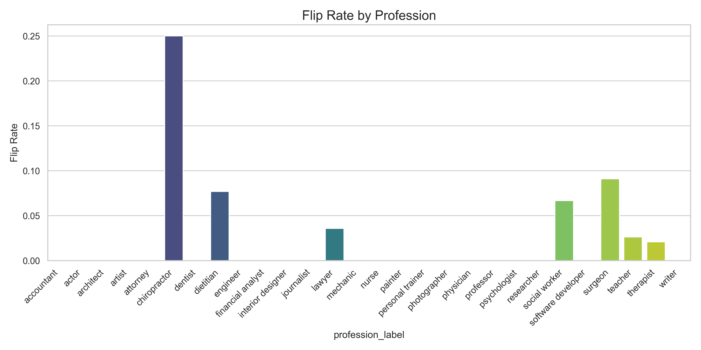
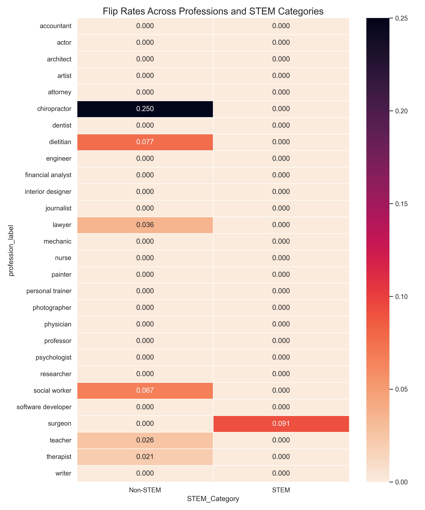
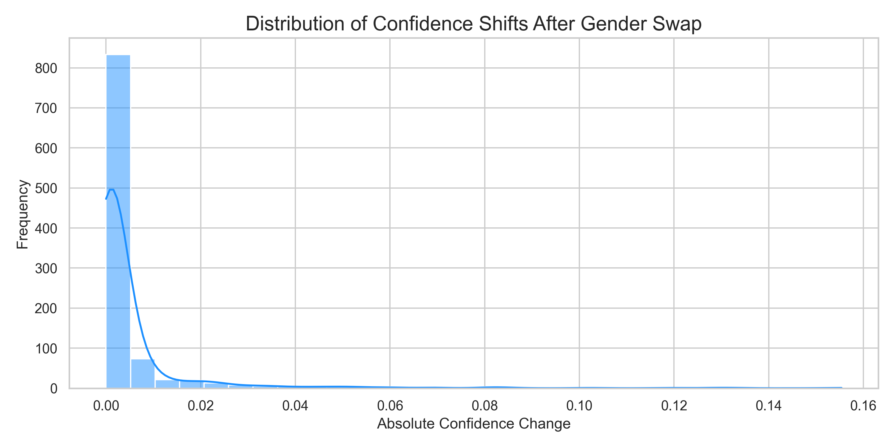
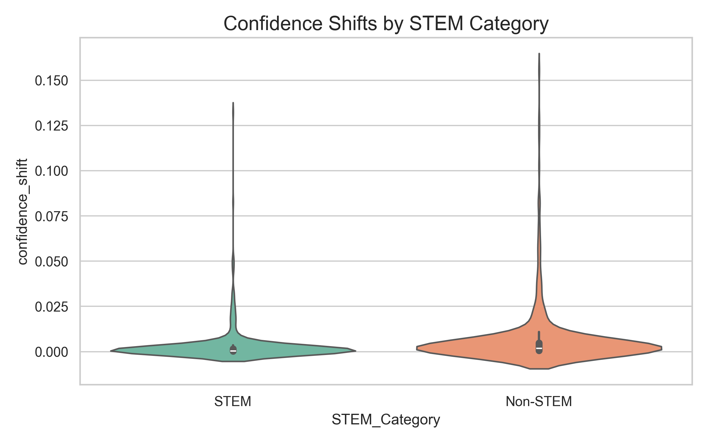

# Gender Bias in Profession Classification

**A Counterfactual Evaluation of DistilBERT Using the Bias in Bios Dataset**

This project investigates gender bias in a DistilBERT-based profession classifier by measuring how swapping gendered language markers in professional biographies changes model predictions and confidence scores — across 28 professions and two categories (STEM vs. Non-STEM).

**Detailed Documentation:** [gender_bias_narrative.pdf](https://github.com/5-07/Gender-Bias-Project/blob/main/gender_bias_narrative.pdf)
---

## Research Question

> To what extent does a DistilBERT-based profession classifier rely on gendered language cues rather than professional content — and does this reliance differ between STEM and Non-STEM professions?

---

## Research Contributions

- **Counterfactual evaluation pipeline** for measuring gender bias in profession classifiers
- **Two core bias metrics** — flip rate and confidence shift — disaggregated across 28 professions
- **STEM vs. Non-STEM analysis** testing whether bias concentrates in stereotypically gendered fields
- **Modular, reproducible codebase** separating data, model, analysis, and visualization concerns
- **Visualization suite** including flip rate bar charts, confidence histograms, violin plots, and heatmaps

---

## Methodology

### Counterfactual Data Augmentation

For each biography in the evaluation set, a counterfactual version is constructed by swapping gendered pronouns and markers (`he`/`she`, `his`/`her`, `him`/`her`) while leaving all professional content unchanged. This produces matched pairs — original and gender-swapped bios describing the same professional.

**Key property:** any change in model prediction between the pair can be attributed to gender cues alone, not differences in described expertise or credentials.

### Dataset

The [Bias in Bios dataset](https://arxiv.org/abs/1901.09451) (De-Arteaga et al., 2019) contains real professional biographies labeled with profession (28 categories) and ground-truth gender. It was introduced specifically to study occupation classification bias in NLP.

### Model

DistilBERT (`distilbert-base-uncased`) fine-tuned for 28-class profession classification. Selected for computational efficiency and representativeness of real-world deployment.

---

## Pipeline Architecture

```
bios_pairs.csv
    ↓
data_utils.py         # Load and sample paired bios
    ↓
model_utils.py        # Load fine-tuned DistilBERT, batch inference
    ↓
bias_analysis.py      # Predict on original + counterfactual bios
    ↓
analysis_utils.py     # Compute flip rate, confidence shift, per-profession metrics
    ↓
plots.py              # Generate all visualizations
```

Each module has a single responsibility. `main.py` orchestrates the full pipeline end-to-end.

---

## Evaluation Metrics

| Metric | Definition | Research Relevance |
|---|---|---|
| **Flip Rate** | % of pairs where gender swap changes predicted profession | Measures classifier sensitivity to gendered language cues |
| **Confidence Shift** | Absolute change in max softmax probability after swap | Quantifies uncertainty introduced by gender marker changes |
| **STEM / Non-STEM Breakdown** | Flip rate by profession category | Tests whether bias concentrates in stereotypically gendered fields |
| **Per-Profession Flip Rate** | Flip rate disaggregated across 28 labels | Identifies which professions are most vulnerable |

### STEM Professions (by label index)
`dentist · engineer · financial analyst · physician · professor · researcher · software developer · surgeon`

---

## Visualizations

| File | Description |
|---|---|
| `flip_rate_by_profession.png` | Bar chart of flip rate across all 28 professions |
| `confidence_shift_histogram.png` | Distribution of confidence change magnitudes |
| `confidence_violin_by_category.png` | STEM vs. Non-STEM confidence shift comparison |
| `flip_rate_heatmap.png` | Flip rates across professions and STEM categories |



*Flip rate across all 28 professions*


*Flip rates across professions and STEM categories*


*Distribution of confidence change magnitudes*


*STEM vs. Non-STEM confidence shift comparison*
---

## Key Finding

Profession predictions are sensitive to gender markers even when professional content is held constant. The confidence shift metric reveals a subtler form of bias: the model becomes internally uncertain after gender swaps even when its final prediction does not change — suggesting gender cues influence internal representations, not just outputs.

---

## Limitations

- Binary gender framing — methodology does not capture non-binary or gender-nonconforming identities
- Pronoun-level swap may miss subtler gendered language patterns (e.g. name-based inference)
- Evaluated on a 1,000-sample subset; full-dataset results may vary
- Findings are specific to the Bias in Bios dataset and this model configuration

---

## Future Directions

- Non-binary and gender-nonconforming counterfactual generation
- Extension to racial and ethnic bias axes
- Comparison across BERT, RoBERTa, and GPT-2 architectures
- Debiasing intervention experiments (adversarial training, data re-weighting)
- Application to real hiring or recommendation system audit contexts

---

## Stack

`Python` · `PyTorch` · `Transformers (HuggingFace)` · `DistilBERT` · `pandas` · `seaborn` · `matplotlib`

---

## References

1. De-Arteaga, M. et al. (2019). Bias in Bios: A Case Study of Semantic Representation Bias in a High-Stakes Setting. ACM FAccT.
2. Sanh, V. et al. (2019). DistilBERT, a distilled version of BERT. arXiv:1910.01108.
3. Bolukbasi, T. et al. (2016). Man is to Computer Programmer as Woman is to Homemaker? NeurIPS.
4. Blodgett, S.L. et al. (2020). Language (Technology) is Power: A Critical Survey of 'Bias' in NLP. ACL.

---

**Researcher:** Muzaina Munir
